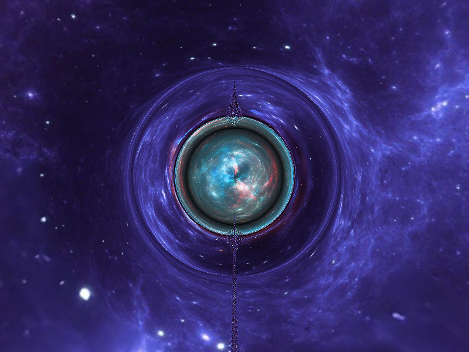

# Wormhole simulation

Modified my previous blackhole code to make this simple wormhole, called **Ellis-Bronnikov wormhole**. This runs faster because of simpler calculations, so I evaluate integrals with rk4 now.

The images are mandatory for this simulation. The images should be **Equirectangular images for 360-degree views**, also called **spherical panoramas**. This makes the simulation way better. Sampling planar images gave weird unwanted artefacts. 

There is still one artefact, which I tried to mitigate by changing whatever I think could be the reason, nothing worked. If you are an expert in these, kindly help.

## Sample output

## Sample video output (from looper.py)

Falling from one universe into another, through a wormhole:

(NOTE: I'm not including the spherical panorama images, because they are licensed. There are some free versions too. Find them and use them on your own.)